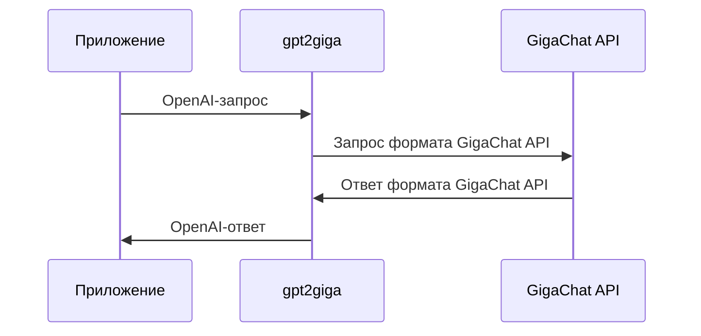

 

  

  <h1 align="center">🦜️🔗 GigaChain (GigaChat + LangChain)</h1>

  

    Набор решений для разработки LLM-приложений на русском языке с поддержкой GigaChat
     
    <a href="https://github.com/ai-forever/gigachain/issues">Создать issue</a>
    ·
    <a href="https://developers.sber.ru/docs/ru/gigachat/sdk/overview">Документация GigaChain</a>
  

---

# О GigaChain

GigaChain – это набор решений для создания приложений с использованием больших языковых моделей (*LLM*).
GigaChain охватывает все этапы разработки от прототипирования и исследования, до запуска в эксплуатацию и поддержки.

В состав GigaChain входят:

* SDK для работы с [моделями GigaChat](https://developers.sber.ru/docs/ru/gigachat/models);
* [библиотеки для разработки комплексных LLM-приложений](#sdk-для-работы-с-gigachat);
* [утилита для проксирования OpenAI-запросов в GigaChat API](#проксирования-openai-запросов);
* [каталог примеров](#примеры).

В этом репозитории вы найдете краткую информацию о библиотеках, которые входят в состав GigaChain, каталог примеров и ссылки на полезные материалы.

## SDK для работы с GigaChat

Библиотеки SDK представляют собой обертку для [REST API GigaChat](https://developers.sber.ru/docs/ru/gigachat/api/reference/rest/gigachat-api).
Они управляют авторизацией запросов, упрощают отправку сообщений и дают доступ к другим методам API.
Репозиторий каждого SDK содержит папку с базовыми примерами работы с ним.

SDK доступны на языках программирования:

* [Python](https://github.com/ai-forever/gigachat);

  Примеры работы с SDK в папке [examples](https://github.com/ai-forever/gigachat/blob/main/examples/README.md).

* [JavaScript](https://github.com/ai-forever/gigachat-js);

  Примеры работы с SDK в папке [examples](https://github.com/ai-forever/gigachat-js/blob/master/examples/README.md).

* [Java](https://github.com/ai-forever/gigachat-java).

  Примеры работы с SDK в папке [gigachat-java-example](https://github.com/ai-forever/gigachat-java/blob/main/gigachat-java-example/README.md).

## Библиотеки для разработки комплексных LLM-приложений

Существуют различные фреймворки и решения, предназначенные для разработки комплексных LLM-приложений, которые используют [работу с функциями](https://developers.sber.ru/docs/ru/gigachat/guides/function-calling) (*инструментами*), реализуют RAG, агентов или другие техники.

К таким решениям относятся популярные проекты [LangChain](https://python.langchain.com/docs/introduction/), [LangGraph](https://langchain-ai.github.io/langgraph/) и [LangChain4j](https://docs.langchain4j.dev/).

GigaChain включает интеграционные библиотеки, для работы с этими проектами:

* `langchain-gigachat` — партнерский пакет популярного open source фреймворка LangChain. Пакет позволяет использовать все возможности фреймворка и моделей GigaChat, в том числе [создание агентов с помощью LangGraph](https://langchain-ai.github.io/langgraph/tutorials/introduction/). Библиотека langchain-gigachat доступна как для [Python](https://github.com/ai-forever/langchain-gigachat), так и для [JavaScript](https://github.com/ai-forever/langchainjs/tree/main/libs/langchain-gigachat).
* `langchain4j-gigachat` — [Java-библиотека](https://github.com/ai-forever/langchain4j-gigachat), которая интегрирует модели GigaChat c проектом LangChain4j.

## Проксирование OpenAI-запросов

[Утилита gpt2giga](https://github.com/ai-forever/gpt2giga) — это прокси-сервер, который перенаправляет запросы, отправленные в OpenAI API, в GigaChat API.

Общая схема работы gpt2giga:

Приложения, проверенные на работу с gpt2giga.

| Приложение                   | Описание                                                                                                                                                                                   |
| ---------------------------- | ------------------------------------------------------------------------------------------------------------------------------------------------------------------------------------------ |
| [Aider](https://aider.chat/) | AI-ассистент для написания приложений.  Подробнее о запуске и настройке Aider для работы с gpt2giga — в [README](https://github.com/ai-forever/gpt2giga/tree/main/integrations/aider) |
| [n8n](https://n8n.io/)       | Платформа для создания nocode-агентов                                                                                                                                                      |

## Примеры

Список примеров для Python, JavaScript и Java.

| Категория              | Python                                                                                                                                                                                                                                                                                                                                                                                                                               | JavaScript                                                                                                | Java                                                                                                                                                                                                                                                                                                                                                                                                         |
| ---------------------- | ------------------------------------------------------------------------------------------------------------------------------------------------------------------------------------------------------------------------------------------------------------------------------------------------------------------------------------------------------------------------------------------------------------------------------------ | --------------------------------------------------------------------------------------------------------- | ------------------------------------------------------------------------------------------------------------------------------------------------------------------------------------------------------------------------------------------------------------------------------------------------------------------------------------------------------------------------------------------------------------ |
| RAG                    | [Ответы на вопросы по заданной книге](/cookbook/gigachat_qa.ipynb) [RAG с текстовым поиском на основе Yandex Search API](/cookbook/yandex_search/retriever.ipynb)                                                                                                                                                                                                                                                                | [Retrieval-Augmented Generation (RAG)](/cookbook/js/rag.ipynb)                                            | --                                                                                                                                                                                                                                                                                                                                                                                                           |
| Агенты                 | [Агент «Продавец телефонов»](/cookbook/gigachat_phone_agent.ipynb) [Агент с текстовым поиском на основе Yandex Search API](/cookbook/yandex_search/tool.ipynb) [Дебаты агентов с разными ролями](/cookbook/agent_debates/README.md) [Агент для получения рекомендаций Spotify](/cookbook/playlists.ipynb) [Агент, выполняющий код](/cookbook/repl_graph/repl.ipynb) [Агент и MCP-сервер](/cookbook/mcp/README.md) | [Пример разработки агента на основе LangGraph.js и GigaChat API](/cookbook/js/langgraph_quickstart.ipynb) | [Работа с MCP-сервером](https://github.com/ai-forever/langchain4j-gigachat/blob/main/langchain4j-gigachat-examples/src/main/java/chat/giga/langchain4j/MCPServerUsageExample.java) [Агент, использующий одну функцию отправки SMS-сообщений](https://github.com/ai-forever/langchain4j-gigachat/blob/main/langchain4j-gigachat-examples/src/main/java/chat/giga/langchain4j/SmsSenderAgentExample.java) |
| Извлечение информации  | [Извлечение структурированной информации](/cookbook/structured_output/structured_output.ipynb)                                                                                                                                                                                                                                                                                                                                       | [Выделение сущностей в тексте](/cookbook/js/extraction.ipynb)                                             | --                                                                                                                                                                                                                                                                                                                                                                                                           |
| Работа с изображениями | [Распознавание изображения](/cookbook/gigachat_vision/gigachat_vision_simple.ipynb) [Генерация структурированных данных на основе изображений](/cookbook/gigachat_vision/gigachat_vision.ipynb) [Получение изображений и видео после генерации](/cookbook/images_and_videos/gigachat_with_images.ipynb)                                                                                                                      | ——                                                                                                        | [Создание изображений](https://github.com/ai-forever/langchain4j-gigachat/blob/main/langchain4j-gigachat-examples/src/main/java/chat/giga/langchain4j/GigaChatImageModelExample.java)                                                                                                                                                                                                                        |
| Работа с функциями     | [Агент для работы с функциями](/cookbook/gigachat_functions_agent.ipynb)                                                                                                                                                                                                                                                                                                                                                             | [Работа с функциями](/cookbook/js/tools.ipynb)                                                            | [Агент, использующий несколько функций](https://github.com/ai-forever/langchain4j-gigachat/blob/main/langchain4j-gigachat-examples/src/main/java/chat/giga/langchain4j/MultiFunctionsAgentExample.java)                                                                                                                                                                                                      |

## Смотрите также

* Документация GigaChat API:
  * [Быстрый страт для физических лиц](https://developers.sber.ru/docs/ru/gigachat/individuals-quickstart);
  * [Быстрый страт для ИП и юридических лиц](https://developers.sber.ru/docs/ru/gigachat/legal-quickstart);
* Документация LangChain:
    * [для Python](https://python.langchain.com/docs/introduction/);
    * [для JavaScript](https://js.langchain.com/docs/introduction/?ref=blog.apify.com);
* [Документация LangGraph](https://langchain-ai.github.io/langgraph/tutorials/introduction/);
* [Документация LangChain4j](https://docs.langchain4j.dev/intro).