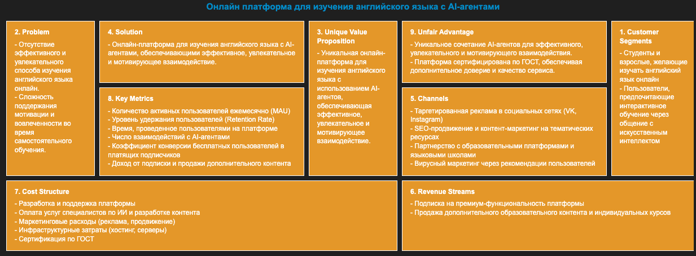

# AI-агент для генерации Lean Canvas

Комплексный AI-агент на базе набора решений [GigaChain](https://github.com/ai-forever/gigachain), который автоматически создает Lean Canvas для вашей бизнес-идеи с анализом конкурентов и возможностью итеративной доработки.



## Что такое Lean Canvas?

**Lean Canvas** — это упрощенная версия Business Model Canvas, адаптированная для стартапов. Это одностраничный бизнес-план, который помогает быстро структурировать и проверить бизнес-идею.

Состоит из 9 ключевых блоков:
1. **Customer Segments** — целевая аудитория
2. **Problem** — проблема, которую решаете
3. **Unique Value Proposition** — уникальное ценностное предложение
4. **Solution** — ваше решение
5. **Channels** — каналы привлечения клиентов
6. **Revenue Streams** — как зарабатываете деньги
7. **Cost Structure** — основные затраты
8. **Key Metrics** — ключевые показатели успеха
9. **Unfair Advantage** — конкурентное преимущество

## Возможности AI-агента

🤖 **Автоматическая генерация** всех 9 блоков Lean Canvas на основе краткого описания идеи  
🔍 **Анализ конкурентов** через веб-поиск для проверки уникальности  
📊 **Красивая визуализация** результатов в виде HTML-таблицы  
🔄 **Итеративная доработка** с учетом вашей обратной связи  
📝 **Структурированный вывод** с помощью Pydantic моделей  
🌐 **Многошаговый процесс** через LangGraph для качественного результата  

## Быстрый старт

### 1. Настройка переменных окружения

Создайте файл `.env` и добавьте необходимые API ключи:

```bash
# Обязательный ключ для GigaChat
GIGACHAT_CREDENTIALS=ваш_ключ_gigachat

# Опциональные настройки
GIGACHAT_BASE_URL=https://gigachat.devices.sberbank.ru/api/v1
TAVILY_API_KEY=ваш_ключ_tavily  # для улучшенного поиска конкурентов
GIGACHAT_VERIFY_SSL_CERTS=false # чтобы не возникали ошибки SSL-сертификатов
```

**Как получить ключ GigaChat:**
- Перейдите на [developers.sber.ru](https://developers.sber.ru/docs/ru/gigachat/quickstart/ind-using-api)
- Зарегистрируйтесь и получите API ключ
- Добавьте его в `.env` файл

### 2. Запуск проекта

```bash
# Установка зависимостей (если используете pip)
pip install -r requirements.txt

# Или через uv (рекомендуется)
uv sync

# Запуск Jupyter notebook
jupyter notebook
# или через uv
uv run jupyter notebook
```

### 3. Использование

Откройте `lean_canvas_agent.ipynb` и следуйте инструкциям в notebook. Просто опишите свою бизнес-идею в одном предложении, и агент создаст полный Lean Canvas!

## Примеры использования

Агент может работать с любыми бизнес-идеями. Примеры из `validation_data.txt`:

- "Умная бутылка для воды"
- "Маркетплейс аренды детских игрушек"  
- "B2B SaaS для микрологистики"
- "VR-тренажёр переговоров"
- "Онлайн платформа для изучения английского языка с AI-агентами"

## Структура проекта

```
lean_canvas/
├── lean_canvas_agent.ipynb    # Основной notebook для работы
├── utils.py                   # Утилиты для визуализации
├── requirements.txt           # Зависимости проекта
├── validation_data.txt        # Примеры бизнес-идей для тестирования
├── .env.example              # Пример настройки переменных окружения
├── steps/                    # Пошаговые примеры разработки
│   ├── 01_llm_enabled_application.py
│   ├── 02_simple_agent_with_web_search.py
│   ├── 03_structured_output.py
│   └── 04_lean_canvas_agent.py  # Финальная версия агента
└── *.png                     # Изображения для документации
```

## Технологический стек

- **[GigaChain](https://github.com/ai-forever/gigachain)** — фреймворк для работы с LLM
- **GigaChat** — основная языковая модель от Сбера
- **LangGraph** — создание многошагового агента
- **Tavily/DuckDuckGo** — веб-поиск для анализа конкурентов
- **Pydantic** — структурированный вывод данных
- **Jupyter** — интерактивная работа и визуализация

## Как это работает

1. **Ввод идеи** — вы описываете бизнес-идею в свободной форме
2. **Последовательная генерация** — агент пошагово заполняет каждый блок Lean Canvas
3. **Анализ конкурентов** — поиск в интернете похожих решений
4. **Визуализация** — создание красивой HTML-таблицы с результатами
5. **Итерации** — возможность доработки на основе вашего фидбека

## Дополнительные возможности

> [!TIP]
> Вы можете настроить дополнительные переменные окружения, поддерживаемые [Python-библиотекой GigaChat](https://github.com/ai-forever/gigachat#настройка-переменных-окружения).

## Участие в разработке

Проект является частью экосистемы GigaChain. Если у вас есть идеи по улучшению или вы нашли ошибки, создавайте issues и pull requests в основном репозитории.

---

**Автор**: AI-Forever Team  
**Лицензия**: См. основной репозиторий GigaChain