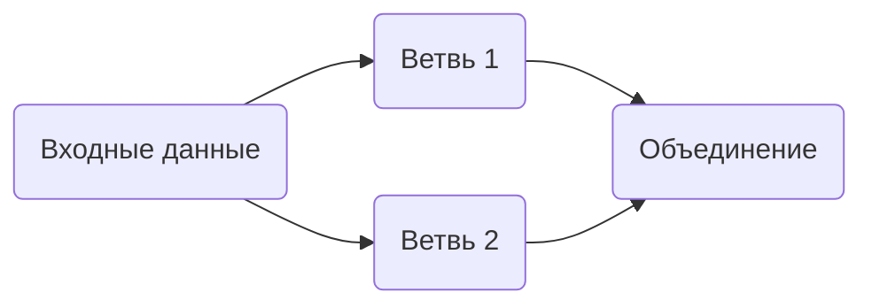

# Обработка входных и выходных данных

Примитив `RunnableParallel` — словарь, значения которого представлены экземплярами Runnable или объектами, которые могут быть приведены к такой форме, например, функцииями.
Все элементы примитива выполняются параллельно.
Каждый из них вызывается со всеми данными, поданными на вход `RunnableParallel`.
Примитив возвращает словарь с результатами выполнения каждого элемента сохраненными в соответствующих полях.

## Форматирование с помощью RunnableParallel

`RunnableParallel` используется для параллелизации, но его также можно применять для преобразования вывода одного Runnable-объекта во входной формат следующего Runnable-объекта.
С его помощью можно разветвить цепочку, чтобы несколько компонентов могли обрабатывать входные данные параллельно.
После чего другие компоненты смогут объединить результаты, чтобы создания итогового ответа.
Такие цепочки образуют следующий вычислительный граф:



В примере на вход в промпт нужно передавать данные в формате map-структуры с полями `context` и `question`.
Ввод пользователя — это просто вопрос.
Поэтому нужно получить контекст с помощью ретривера и передать ввод пользователя в поле  `question`.

```python
%pip install --upgrade --quiet  gigachain faiss-cpu
```


```python
from langchain.chat_models.gigachat import GigaChat
from langchain_community.embeddings.gigachat import GigaChatEmbeddings
from langchain_community.vectorstores import FAISS
from langchain_core.output_parsers import StrOutputParser
from langchain_core.prompts import ChatPromptTemplate
from langchain_core.runnables import RunnablePassthrough

vectorstore = FAISS.from_texts(
    ["harrison worked at kensho"],
    embedding=GigaChatEmbeddings(
        credentials="<авторизационные_данные>", verify_ssl_certs=False
    ),
)
retriever = vectorstore.as_retriever()
template = """Answer the question based only on the following context:
{context}

Question: {question}
"""

# В промпте следуюет передать данные, подходящие для полей "context" (контекст) и "question" (вопрос)
prompt = ChatPromptTemplate.from_template(template)
model = GigaChat(
    credentials="<авторизационные_данные>",
    verify_ssl_certs=False,
)

retrieval_chain = (
    {"context": retriever, "question": RunnablePassthrough()}
    | prompt
    | model
    | StrOutputParser()
)

retrieval_chain.invoke("where did harrison work?")
```


<CodeOutputBlock lang="python">

```python
    'Harrison worked at Kensho.'
```

</CodeOutputBlock>

:::note

При соединении RunnableParallel с другим Runnable-объектом не нужно оборачивать словарь в класс `RunnableParallel`, так как типы преобразуются автоматически.
В контексте цепочки оба варианта будут работать одинаково:

:::

```python
{"context": retriever, "question": RunnablePassthrough()}
```

```python
RunnableParallel({"context": retriever, "question": RunnablePassthrough()})
```

```python
RunnableParallel(context=retriever, question=RunnablePassthrough())
```

Подробнее — в разделе [Принудительное преобразование](/docs/how_to/sequence/#coercion).
## Использование itemgetter

При работе с `RunnableParallel` для упрощения извлечения данных из map-структуры можно использовать Python-функцию [`itemgetter`](https://docs.python.org/3/library/operator.html#operator.itemgetter).


Пример ниже демонстрирует, как извлечь определенные поля из map-структуры:

```python
from operator import itemgetter

from langchain_community.embeddings.gigachat import GigaChatEmbeddings
from langchain_community.vectorstores import FAISS
from langchain_core.output_parsers import StrOutputParser
from langchain_core.prompts import ChatPromptTemplate

vectorstore = FAISS.from_texts(
    ["harrison worked at kensho"],
    embedding=GigaChatEmbeddings(
        credentials="<авторизационные_данные>", verify_ssl_certs=False
    ),
)
retriever = vectorstore.as_retriever()

template = """Answer the question based only on the following context:
{context}

Question: {question}

Answer in the following language: {language}
"""
prompt = ChatPromptTemplate.from_template(template)

chain = (
    {
        "context": itemgetter("question") | retriever,
        "question": itemgetter("question"),
        "language": itemgetter("language"),
    }
    | prompt
    | model
    | StrOutputParser()
)

chain.invoke({"question": "where did harrison work", "language": "italian"})
```


<CodeOutputBlock lang="python">

```python
    'Harrison ha lavorato a Kensho.'
```

</CodeOutputBlock>

## Параллелизация выполнения

`RunnableParallel` позволяет параллельно выполнять несколько Runnable-объектов и возвращать результат их работы в виде map-структуры.

```python
from langchain.chat_models.gigachat import GigaChat
from langchain_core.prompts import ChatPromptTemplate
from langchain_core.runnables import RunnableParallel

model = GigaChat(credentials="<авторизационные_данные>", verify_ssl_certs=False)
joke_chain = ChatPromptTemplate.from_template("tell me a joke about {topic}") | model
poem_chain = (
    ChatPromptTemplate.from_template("write a 2-line poem about {topic}") | model
)

map_chain = RunnableParallel(joke=joke_chain, poem=poem_chain)

map_chain.invoke({"topic": "bear"})
```


<CodeOutputBlock lang="python">

```python
    {'joke': AIMessage(content="Why don't bears like fast food? Because they can't catch it!", response_metadata={'token_usage': {'completion_tokens': 15, 'prompt_tokens': 13, 'total_tokens': 28}, 'model_name': 'gpt-3.5-turbo', 'system_fingerprint': 'fp_d9767fc5b9', 'finish_reason': 'stop', 'logprobs': None}, id='run-fe024170-c251-4b7a-bfd4-64a3737c67f2-0'),
 'poem': AIMessage(content='In the quiet of the forest, the bear roams free\nMajestic and wild, a sight to see.', response_metadata={'token_usage': {'completion_tokens': 24, 'prompt_tokens': 15, 'total_tokens': 39}, 'model_name': 'gpt-3.5-turbo', 'system_fingerprint': 'fp_c2295e73ad', 'finish_reason': 'stop', 'logprobs': None}, id='run-2707913e-a743-4101-b6ec-840df4568a76-0')}
```

</CodeOutputBlock>

## Параллелизм

`RunnableParallel` также полезен для одновременного выполнения независимых процессов, поскольку каждый экземпляр Runnable в map-структуре выполняется параллельно.
Так, на примере представленных цепочек `joke_chain`, `poem_chain` и `map_chain` можно убедиться, что все они выполняются примерно за одно время.
При этом цепочка `map_chain` выполняет две другие цепочки.

```python
%%timeit

joke_chain.invoke({"topic": "bear"})
```


<CodeOutputBlock lang="python">

```default
    610 ms ± 64 ms per loop (mean ± std. dev. of 7 runs, 1 loop each)
```

</CodeOutputBlock>


```python
%%timeit

poem_chain.invoke({"topic": "bear"})
```


<CodeOutputBlock lang="python">

```default
    599 ms ± 73.3 ms per loop (mean ± std. dev. of 7 runs, 1 loop each)
```

</CodeOutputBlock>


```python
%%timeit

map_chain.invoke({"topic": "bear"})
```


<CodeOutputBlock lang="python">

```default
    643 ms ± 77.8 ms per loop (mean ± std. dev. of 7 runs, 1 loop each)
```

</CodeOutputBlock>
